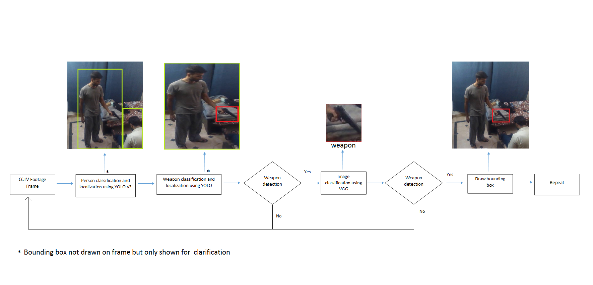

# Weapon-Detection-in-CCTV-Footage
Repository contains implementation of weapon detection pipeline which consists of 2 independently trained object detection and one classification algorithm.


VGG_16 was trained using [PyimageSearch](https://www.pyimagesearch.com/2019/05/20/transfer-learning-with-keras-and-deep-learning/) tutorial on gun(~11000) images.

## Inference
__VGG__

for static images :
``` python3 predict.py --image test_imgs/gun.jpg ```

webcame : 
``` python3 webcam_VGG.py ```
